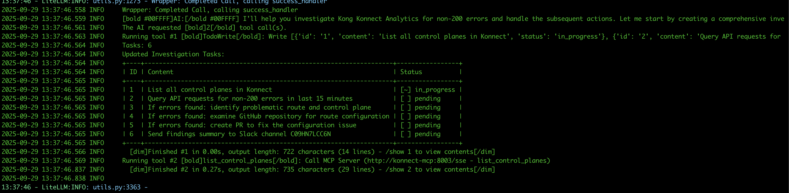

<p align="center" width="100%">
    
</p>

# Kong Auto Rollback AI Agent
This project is Kong auto rollback AI Agent. Its purpose is to hinge off of an AI Agent
to improve the MTTR and Roll back speed for Kong configurations.
The AI Agent runs on a schedule monitoring the Advanced Analytics of the Kong Gateway and if constant errors
are seen it will try work out a recent change that has been committed to Kong Config repository and revert
the change. A PR will be created, using GitHub actions to both validate the config change when PR is created
as well as another workflow that auto merges the PRs. A final workflow will sync the configuration 

## Tokens / Keys
This chart needs a few tokens and keys for all the services to work.
There are a few ways to pass these into the chart

1. Pure env vars
2. Via a config map
3. Via a secret

For options 2 and 3 you will need to create the config map or secret yourself either manually or using another tool
or just simply set the env var using the `--var` option of helm

## Pre-req's
### Claude AI Token
The AI Agent has been tested `ONLY` With Claude and so an account and token with this service will be needed
to use this project. Once an API Key is created it needs to be passed into the chart on installation as per the below

Create an account and then a key at this link: https://console.anthropic.com/settings/keys

### Github
Github has been the git repository service used for this project but other services will work (just not tested).
Simply create a git PAT and give it enough permissions to read and write to your repository.

Create a PAT here: https://github.com/settings/tokens

Set the following scopes on your `Tokens (classic)` PAT

<p align="center" width="100%">
    
</p>

You then also want to create a new repository to house the Kong config in, make it public.

### Slack
Slack is being used as a means of alerting when something happens. In order for this to work you
will need a slack workspace and the admin access to create Slack Apps. Follow the following steps
to create a User token and get the slack team id:

1. Navigate to Slack workspace in your browser
2. Click Admin Tools on left panel > Apps and workflows
3. Click Build (top right)
4. Click Create New App
5. Click From Scratch - Give it a App Name and Pick your workspace
6. Click OAuth and permissions in left menu
7. Under scopes, create User Token Scopes with the following scopes
   1. **channels:history** - Allows viewing messages and content in public channels
   2. **channels:read** - Enables access to basic information about channels
   3. **chat:write** - Grants permission to send messages as the application
   4. **reactions:write** - Permits adding emoji reactions to messages
   5. **users:read** - Allows viewing basic information about workspace users
   6. **users:read.email** - (Optional) Enables access to user email addresses
8. Up the top of the page click "Install to <name of workspace>"
9. Copy the User OAuth Token starting with `xoxp-`

You will also need a Slack channel to send alerts to, but the tool needs the channel id not name
which can be obtained via the UI, click on the channel name to open its settings and navigate to the
bottom of the window

<p align="center" width="100%">
    
</p>

Finally, you need the Team Id, again nagivate to your Slack workspace in the browser and look at the URL, the
parameter starting with a `T` is your team ID.

```commandline
https://app.slack.com/client/T00000
```

Once all configured you will share these details in the chart below.

### Konnect
The last service you need an account with is Kong Konnect. You can register for a free account here: https://cloud.konghq.com/
Once you have logged in you will need to create a TOKEN so that the agent can access the APIs.
This is done by creating System Accounts:

1. Navigate to Organization on the right hand side
2. Click System Accounts -> Create one
3. Click Manage Tokens on the top right
4. Create a new token and copy the token

Then provide the tokens when installing the AI agent chart.

### K8s
This project is k8s based so you need a cluster installed. I LOVE kind so I recommend using that, but you
can use any of them, to install kind navigate here: https://kind.sigs.k8s.io/docs/user/quick-start/#installation

Of course to run this you need docker installed so make sure you have something like Docker Desktop installed too,
here is the link for installing this on macOS: https://docs.docker.com/desktop/setup/install/mac-install/

Then create a kind cluster
```bash
kind create cluster
```

### k9s
To access the cluster I use a tool called k9s, I recommend installing that too: https://k9scli.io/topics/install/

## Installation
### Kong Gateway
To deploy a data plane in your Konnect organization, use the token you created above and run the install script provided

The script takes 3 inputs
1. Konnect Token (mandatory)
2. Namespace (optional: default kong)
3. Konnect Region (optional: default eu)

```bash
bash kong-gateway-deployment/install.sh <KONNECT-TOKEN>
```

This will do the following:
1. Generate SSL certs
2. Create a control plane in Konnect
3. Upload `tls.cert` to the control plane
4. Add kong helm registry
5. Install the data plane in current cluster context in kong namespace

Once installed you should verify that a kong pod has been created in the kong namespace
and is running. Also navigate to Konnect and check your control is created with a data plane
linked to it.

<p align="center" width="100%">
    
</p>

### Kong config
First navigate to settings of the repository and create a Action Secret called `KONNECT_TOKEN` and use
the Konnect token generated above.

Next is to set up the Kong config. There is a template for the repo in this project under the `kong-config-template` folder.

Using the repository you created above to push the content from the `kong-config-template` folder.
Then commit and push all changes up to github

```bash
git clone <new_repo>
cd <new_repo>
cp -R <path-to-this-repo>/kong-config-template/.github .
cp <path-to-this-repo>/kong-config-template/kong.yaml .
git add . && git commit -m "Initial Commit" && git push origin main
```

Pushing the changes up will auto run the pipeline and push the configuration to your Konnect control plane. You should
now see the service, route and plugin inside Konnect

<p align="center" width="100%">
    
</p>

Test this out by port forwarding your data plane and then running the following command using httpie
```bash
http :8000/echo
```

You should see a response as follows
```bash
 ~ % http :8000/echo
HTTP/1.1 200 OK
Access-Control-Allow-Credentials: true
Access-Control-Allow-Origin: *
Connection: keep-alive
Content-Length: 564
Content-Type: application/json
Date: Mon, 29 Sep 2025 09:38:13 GMT
Server: gunicorn/19.9.0
Via: 1.1 kong/3.11.0.3-enterprise-edition
X-Kong-Proxy-Latency: 2
X-Kong-Request-Id: f76cab7ede17df15bb0621035e5e1a58
X-Kong-Upstream-Latency: 1049

{
    "args": {},
    "data": "",
    "files": {},
    "form": {},
    "headers": {
        "Accept": "*/*",
        "Accept-Encoding": "gzip, deflate",
        "Host": "httpbin.org",
        "User-Agent": "HTTPie/3.2.4",
        "X-Amzn-Trace-Id": "Root=1-68da5385-58b541b139da69776374badd",
        "X-Forwarded-Host": "localhost",
        "X-Forwarded-Path": "/echo",
        "X-Forwarded-Prefix": "/echo",
        "X-Kong-Request-Id": "f76cab7ede17df15bb0621035e5e1a58"
    },
    "json": null,
    "method": "GET",
    "origin": "127.0.0.1, 81.150.180.48",
    "url": "https://localhost/anything"
}
```

### AI Agent
Once you have Kong gateway setup and sync'ed with config then its time to install the AI Agent. 
There is a handy helm chart in this repo that you can use to install things. All you need to do is create a few
secrets to pass in your tokens then you are good to go

```bash
kubectl create namespace ai

kubectl create secret generic mcp-konnect-secret \
  --from-literal=KONNECT_ACCESS_TOKEN='<konnect-access-token>' \
  --from-literal=KONNECT_REGION='<konnect-region>' \
  -n ai
  
kubectl create secret generic mcp-slack-secret \
  --from-literal=SLACK_BOT_TOKEN='<slack-bot-token>' \
  --from-literal=SLACK_TEAM_ID='<team-id>' \
  --from-literal=SLACK_CHANNEL_IDS='<channel-ids>' \
  --from-literal=SLACK_MCP_XOXP_TOKEN='<xoxp-token>' \
  --from-literal=SLACK_MCP_ADD_MESSAGE_TOOL='<add-message-tool>' \
  -n ai
```

Then install the chart, make sure to replace the below inputs with the valid credentials
```bash
cd charts
helm install ai-agent ai-auto-rollback \
    --set "mcp.konnect.envSecret=mcp-konnect-secret" \
    --set "mcp.slack.envSecret=mcp-slack-secret" \
    --set "holmes.additionalEnvVars[0].name=GIT_REPO" \
    --set "holmes.additionalEnvVars[0].value=<owner/reponame>" \
    --set "holmes.additionalEnvVars[1].name=GIT_BRANCH" \
    --set "holmes.additionalEnvVars[1].value=main" \
    --set "holmes.additionalEnvVars[2].name=ANTHROPIC_API_KEY" \
    --set "holmes.additionalEnvVars[2].value=<claude-api-key>" \
    --set "holmes.additionalEnvVars[3].name=GIT_CREDENTIALS" \
    --set "holmes.additionalEnvVars[3].value=<github-pat>" \
    -n ai
```

### Example installation
```bash
kubectl create namespace ai
kubectl create secret generic mcp-konnect-secret \
--from-literal=KONNECT_ACCESS_TOKEN='spat_xxx' \
--from-literal=KONNECT_REGION='eu' \
-n ai
```
```bash
kubectl create secret generic mcp-slack-secret \
--from-literal=SLACK_TEAM_ID='T000000' \
--from-literal=SLACK_CHANNEL_IDS='C0000000' \
--from-literal=SLACK_MCP_XOXP_TOKEN='xoxp-xxxxx' \
--from-literal=SLACK_MCP_ADD_MESSAGE_TOOL='true' \
-n ai
```
```bash
cd charts
helm upgrade -i ai-agent ai-auto-rollback \
    --set "mcp.konnect.envSecret=mcp-konnect-secret" \
    --set "mcp.slack.envSecret=mcp-slack-secret" \
    --set "holmes.additionalEnvVars[0].name=GIT_REPO" \
    --set "holmes.additionalEnvVars[0].value=owner/repo" \
    --set "holmes.additionalEnvVars[1].name=GIT_BRANCH" \
    --set "holmes.additionalEnvVars[1].value=main" \
    --set "holmes.additionalEnvVars[2].name=ANTHROPIC_API_KEY" \
    --set "holmes.additionalEnvVars[2].value=sk-ant-xxxxx" \
    --set "holmes.additionalEnvVars[3].name=GIT_CREDENTIALS" \
    --set "holmes.additionalEnvVars[3].value=ghp_xxxx" \
    -n ai
```

Now navigate to the `ai` namespace and check that everything is running

<p align="center" width="100%">
    
</p>

### Using the Agent
Now that you have everything installed lets use it. Firstly lets port forward the Kong gateway dataplane

```bash
kubectl port-forward svc/kong-kong-proxy 8000:80 -n kong
```

Now with that accessible lets run a `watch` command and see traffic coming through the gateway

```bash
watch -n1 "http :8000/echo"
```

Lets now make a change to our configuration, add a request termination plugin, so edit `kong.yaml` in your 
configuration repo
```yaml
plugins:
  ...
  - name: request-termination
    config:
      status_code: 503
      message: '"Service is now unavailable"'
  ...
```

Commit and push that change and the pipeline should auto run and push the changes to your gateway

Now we should start seeing some errors
```bash
Every 1.0s: http :8000/echo                                             ~: 10:56:55

{"message":"\"Service is now unavailable\""}
```

Let's now watch our agent, so view the logs of the holmes pod in k9s and look out on your slack channel as well

Your logs should look something like this, seeing the Investigation tasks your Agentic agent is working on

<p align="center" width="100%">
    
</p>

You will eventually get the following message in slack

<p align="center" width="100%">
    
</p>

Click in the PR, check the change, merge it and your traffic will start to work again. 

BOSH! Your configuration has been rolled back by the Kong Agentic AI Agent

## Current Limitations
One limitation I have noticed while testing was the Claude token limits. What I found was I kept getting
rate limited when my AI Agent made calls to the LLM. This seemed to fix itself I think when some of the calls
could be cached as the data was not changing.

A possible solution is to get the limits increased or use another LLM like AWS Bedrock,